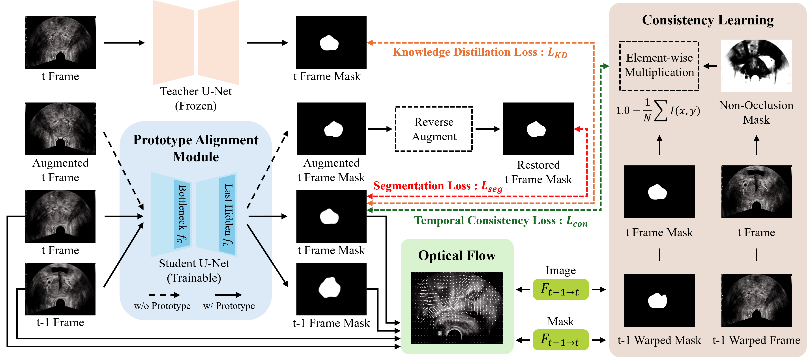
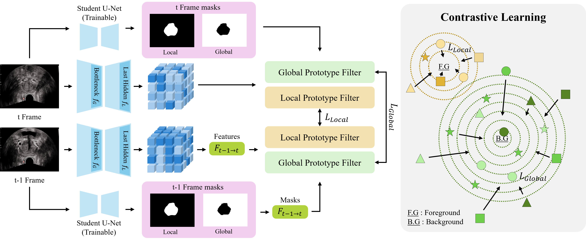

# Distilling Temporal Coherence into 2D Networks for Transrectal Ultrasound Prostate Video Segmentation

> **Accepted on MICCAI 2026** 
> 
> **Project Page:** [https://dydevelop.github.io/DTC-TRUS/](https://dydevelop.github.io/DTC-TRUS/)

This repository provides the official implementation of our **Temporally Consistent Learning Framework** for real-time prostate segmentation in Transrectal Ultrasound (TRUS) videos. Our method distills temporal coherence into a standard 2D backbone during training, achieving temporally stable predictions at inference with **no 3D computation overhead**.

---

## Overview



Conventional 2D segmentation models treat video frames independently, causing inter-frame "flickering" artifacts that are clinically unacceptable. While 3D or recurrent architectures can address this, they are too slow for real-time intra-operative use. We resolve this dilemma with a training-time framework that teaches a lightweight 2D student to be temporally consistent — without requiring dense video annotations.

**Key Idea:** The prostate is geometrically stable, but the surrounding acoustic environment fluctuates due to physiological motion and transducer pressure. Naive temporal constraints propagate erroneous gradients from these unstable regions. Our framework selectively attends to reliable regions through confidence-weighted optical flow and dual-scale prototype alignment.

---

## Project Page

For a visual summary of the paper, including the framework overview, TRUS-V benchmark details, quantitative results, and citation information, visit the project page:

[**DTC-TRUS Project Page**](https://dydevelop.github.io/DTC-TRUS/)

---

## Method

Our framework consists of four synergistic components:

### 1. Self-Supervised Equivariance & Knowledge Distillation
- **Flip-based pseudo-label generation**: Predictions under the original and horizontally flipped inputs are averaged to form stable pseudo-labels, circumventing the cost of dense manual video annotation.
- **Student-Teacher KD**: A frozen pretrained Teacher (trained on static images) supervises the Student via temperature-scaled MSE on logits, preventing catastrophic forgetting of spatial priors while adapting to video dynamics.

### 2. Confidence-Weighted Temporal Consistency (`L_con`)
- Optical flow (Farneback) warps the previous frame's predicted mask to the current frame coordinate system.
- A **non-occlusion confidence map** `M_noc = exp(-|I_t - W(I_{t-1}, F)|)` down-weights occluded or acoustically unstable regions.
- Consistency loss maximizes structural agreement only in high-confidence regions:

```
L_con = 1 - (1/N) * Σ_p M_noc(p) · (1 - |P_t(p) - P̃_{t-1→t}(p)|)
```

### 3. Dual-scale Prototype Alignment Module (`L_proto`)

- Prototypes are computed via masked average pooling at both **local (decoder)** and **global (bottleneck)** feature scales.
- Foreground local prototypes are warped across time for boundary-level alignment; background global prototypes are compared directly for scene-level stability.
- Area-adaptive cross-weighting automatically balances the two scales — smaller foregrounds receive higher local boundary weight:

```
L_proto = w_cb · (1 - cos(ṽ^loc_{cf,t-1}, v^loc_{cf,t})) + w_cf · (1 - cos(v^glob_{cb,t-1}, v^glob_{cb,t}))
```

### 4. Total Objective
```
L_total = λ_seg·L_seg + λ_KD·L_KD + λ_con·L_con + λ_proto·L_proto
```

> **Inference efficiency**: Only the 2D Student network is deployed at inference. No optical flow, no Teacher, no 3D computation — guaranteeing real-time performance.

---

## TRUS-V Benchmark

We release **TRUS-V**, a new multi-view TRUS video segmentation benchmark:

| Property | Details |
|---|---|
| Total frames | 2,679 densely annotated frames |
| Patients | 10 patients |
| Views | Axial + Sagittal (paired per patient) |
| Sequences | 20 continuous video sequences |
| Split | 2,405 train / 274 test (patient-level) |
| Annotation | Semi-automated (5-fold U-Net ensemble + radiologist refinement) |
| Ensemble DSC | 0.95 (Axial), 0.93 (Sagittal) |

The dataset will be made publicly available soon. (Under DRB Review)

---

## Results
**Bold** indecates our method.
### SUN-SEG (Video Polyp Segmentation Benchmark)

| Method | Type | S_α ↑ | E_φ^mn ↑ | F_β^w ↑ | Dice ↑ | Sen ↑ |
|---|---|---|---|---|---|---|
| U-Net | 2D | 0.669 | 0.677 | 0.459 | 0.530 | 0.420 |
| ACSNet | 2D | 0.782 | 0.779 | 0.642 | 0.713 | 0.601 |
| MSRF-Net | 2D | 0.794 | 0.780 | 0.652 | 0.701 | 0.600 |
| SSTAN | Video | 0.805 | 0.838 | 0.691 | 0.726 | 0.662 |
| DALA | Video | 0.837 | 0.854 | 0.722 | 0.768 | 0.721 |
| **Ours** | **2D** | **0.816** | **0.882** | **0.738** | **0.746** | **0.719** |

Our 2D method rivals or surpasses heavy video-based models at **89.95 FPS** (ACSNet backbone).

### TRUS-V (In-house Clinical Benchmark)

| Method | Type | S_α ↑ | E_φ^mn ↑ | F_β^w ↑ | Dice ↑ | Sen ↑ |
|---|---|---|---|---|---|---|
| U-Net | 2D | 0.964 | 0.985 | 0.808 | 0.817 | 0.829 |
| U-Net++ | 2D | 0.967 | 0.988 | 0.821 | 0.820 | 0.827 |
| MSRF-Net | 2D | 0.965 | 0.987 | 0.821 | 0.821 | 0.838 |
| SSTAN | Video | 0.963 | 0.980 | 0.816 | 0.819 | 0.837 |
| DALA | Video | 0.908 | 0.931 | 0.539 | 0.729 | 0.746 |
| **Ours** | **2D** | **0.967** | **0.988** | **0.830** | **0.829** | **0.839** |

Achieves state-of-the-art at **127.97 FPS** (U-Net++ backbone).

### Ablation Study (SUN-SEG-Easy, Unseen)

| Configuration | S_α ↑ | Dice ↑ |
|---|---|---|
| Baseline (L_seg only) | 0.274 | 0.171 |
| + KD only (w/o Temporal) | 0.793 | 0.701 |
| + KD + Proto (w/o Consistency) | 0.813 | 0.735 |
| + KD + Consistency (w/o Proto) | 0.810 | 0.722 |
| + KD + Single-scale Proto + Consistency | 0.808 | 0.721–0.722 |
| **Full Model (Dual-scale)** | **0.816** | **0.746** |

---

## Installation

```bash
conda create -n seg_bench python=3.10 -y
conda activate seg_bench

pip install torch==2.4.1 torchvision==0.19.1 torchaudio==2.4.1 \
    --index-url https://download.pytorch.org/whl/cu121

pip install einops yacs matplotlib opencv-python timm \
    ml-collections pydicom pandas scikit-learn kornia

pip install albumentations==1.3.1
```

---

## Project Structure

```
project_root/
├── src/
│   ├── network/
│   │   ├── conv_based/              # U-Net, U-Net++, U-Net 3+ 
│   │   ├── transformer_based/       # TransNetR, ColonSegNet, AttU-Net, ACSNet
│   │   └── hybrid_based/            # PraNet, MedNeXt, CMUNet, CMUNeXt, UNeXt, MSRF-Net
│   ├── dataloader/
│   │   ├── dataset.py               # Static image dataloader
│   │   └── temporal_dataset_ddp.py  # Video sequence dataloader (DDP-compatible)
│   ├── utils/
│   │   ├── losses.py                # BCE-Dice loss, structure loss
│   │   ├── metrics.py               # IoU, DSC, SE, PC, F1, ACC
│   │   ├── metrics_SUN.py           # S-measure, E-measure, weighted F-measure
│   │   └── util.py                  # Optical flow, warping, AverageMeter
│   └── load_model.py
├── scripts/
│   ├── img_main.py                  # Stage 1: Static image training (Teacher)
│   ├── vid_main_flip_kd_proto_ddp.py  # Stage 2: Video training (Student, DDP)
│   ├── vid_infer_single_patient.py  # Per-patient video inference & visualization
│   ├── compute_flow_warp.py         # Optical flow utilities and visualization
│   └── 3D_recon.py                  # 3D mesh reconstruction from NIfTI masks
├── image_checkpoint/                # Pretrained Teacher checkpoints
│   └── checkpoint_axi/
│       └── U_Net_0_model.pth
├── video_results/                   # Saved NIfTI segmentation outputs (.nii.gz)
├── single_patient_results/          # Per-patient inference videos (.mp4)
└── etc_dataset/
    └── list/
        └── etc_dataset.csv
```

---

## Usage

### Stage 1 — Train the Teacher (Static Image Segmentation)

Train a 2D segmentation model on labeled static TRUS images. This checkpoint is used as the frozen Teacher in Stage 2.

```bash
python scripts/img_main.py \
    --model U_Net \
    --dataset_csv Prostate_whole.csv \
    --base_lr 0.01 \
    --batch_size 4 \
    --epoch 50 \
    --img_size 256 448 \
    --mode train
```

To evaluate a trained static model:

```bash
python scripts/img_main.py \
    --model U_Net \
    --mode test \
    --checkpoint /path/to/checkpoint.pth
```

---

### Stage 2 — Train the Student (Temporally Consistent Video Segmentation)

The Student is trained on unlabeled video sequences using flip-based pseudo-labels, knowledge distillation from the Teacher, confidence-weighted temporal consistency, and dual-scale prototype alignment.

**Single GPU:**
```bash
python scripts/vid_main_flip_kd_proto_ddp.py \
    --model U_Net \
    --use_prototype \
    --checkpoint image_checkpoint/checkpoint_axi/U_Net_0_model.pth \
    --dataset SUN \
    --base_lr 1e-3 \
    --batch_size 8 \
    --epoch 50 \
    --sequence_length 3 \
    --flow_method farneback \
    --seg_lam 3.0 \
    --kd_lam 1.0 \
    --con_lam 2.0 \
    --proto_lam 0.1 \
    --temperature 4.0 \
    --gpu_id 0
```

**Multi-GPU (DDP) with AMP:**
```bash
python scripts/vid_main_flip_kd_proto_ddp.py \
    --model U_Net \
    --use_prototype \
    --checkpoint image_checkpoint/checkpoint_axi/U_Net_0_model.pth \
    --multi_gpu \
    --use_amp \
    --batch_size 4 \
    --gradient_accumulation_steps 2
```

**Target specific GPUs:**
```bash
CUDA_VISIBLE_DEVICES=0,1,2 python scripts/vid_main_flip_kd_proto_ddp.py \
    --multi_gpu --use_amp
```

**Key training arguments:**

| Argument | Default | Description |
|---|---|---|
| `--model` | `U_Net` | Backbone architecture |
| `--use_prototype` | `False` | Enable Dual-scale Prototype Alignment Module |
| `--checkpoint` | — | **Required**: Path to pretrained Teacher checkpoint |
| `--sequence_length` | `3` | Number of frames per temporal sequence |
| `--frame_gap` | `1` | Temporal stride between frames |
| `--flow_method` | `farneback` | Optical flow method (`farneback`, `lucas_kanade`, `ncc`) |
| `--seg_lam` | `3.0` | Weight for segmentation loss (λ_seg) |
| `--kd_lam` | `1.0` | Weight for knowledge distillation loss (λ_KD) |
| `--con_lam` | `2.0` | Weight for temporal consistency loss (λ_con) |
| `--proto_lam` | `0.1` | Weight for prototype alignment loss (λ_proto) |
| `--temperature` | `4.0` | KD temperature parameter τ |
| `--multi_gpu` | `False` | Enable DDP multi-GPU training |
| `--use_amp` | `False` | Enable automatic mixed precision |
| `--patience` | `10` | Early stopping patience (epochs) |

Training logs (total loss, seg loss, KD loss, temporal loss, DSC, S-measure, etc.) are printed per epoch. The best checkpoint is saved based on validation DSC. A `training_config.json` with final λ settings and metrics is also saved.

---

### Inference — Single Patient Video

Run frame-by-frame segmentation on a single patient and export an annotated `.mp4` video with green mask overlay and blue contours.

```bash
python scripts/vid_infer_single_patient.py \
    --patient_id 15213598 \
    --model U_Net \
    --checkpoint /path/to/student_checkpoint.pth \
    --video_dir /path/to/video_test \
    --output_dir /path/to/single_patient_results \
    --view axi \
    --fps 30
```

| Argument | Options | Description |
|---|---|---|
| `--view` | `axi`, `sag`, `both` | Ultrasound view plane to process |
| `--fps` | `30` | Output video frame rate |
| `--img_size` | `256` | Input resolution for model |

Output videos are named `<patient_id>_<checkpoint_info>.mp4` and saved under `<output_dir>/<checkpoint_stem>/`.

---

### 3D Reconstruction

Reconstruct a rotating 3D prostate mesh from a predicted NIfTI segmentation mask (`.nii.gz`) using marching cubes, and save as an animated `.gif`.

```bash
python scripts/3D_recon.py
```

Configure `id` (patient ID), `mode` (`img` or `vid`), and `type` (`axi`/`sag`) directly in the script header. Output GIFs are saved under `3D_recon/<patient_id>/<datetime>/`.

---

## Supported Architectures

| Category | Models |
|---|---|
| Conv-based | U-Net, U-Net++, U-Net 3+, ColonSegNet |
| Transformer | AttU-Net, ACSNet, PraNet, MedNeXt, TransNetR |
| Hybrid | MSRF-Net, CMUNet, CMUNeXt, UNeXt |

---

## Datasets

| Dataset | Modality | Size | Purpose |
|---|---|---|---|
| **TRUS-V** (ours, to be released) | Prostate TRUS video | 2,679 frames (Axial + Sagittal) | Video training & evaluation |
| Static TRUS | Prostate TRUS images | 2,140 Axial + 2,260 Sagittal | Inital labeler pretraining |
| **SUN-SEG** | Video polyp (colonoscopy) | 158,690 frames | Generalization evaluation |

---

## Citation

If you find this work useful in your research, please cite:

```bibtex
@inproceedings{anonymous2026trus,
  title     = {Distilling Temporal Coherence into 2D Networks for Transrectal Ultrasound Prostate Video Segmentation},
  author    = {Anonymized Authors},
  booktitle = {Medical Image Computing and Computer-Assisted Intervention (MICCAI)},
  year      = {2026}
}
```

---

## License

This project is released for research purposes. The TRUS-V dataset will be released under a data-sharing agreement upon paper acceptance. Please refer to `LICENSE` for full terms.
